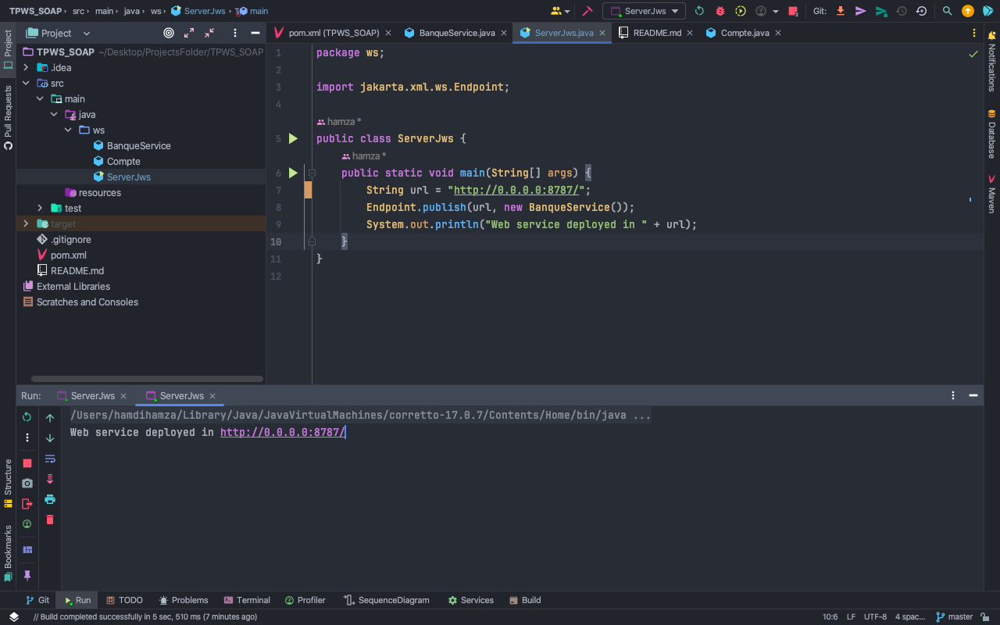
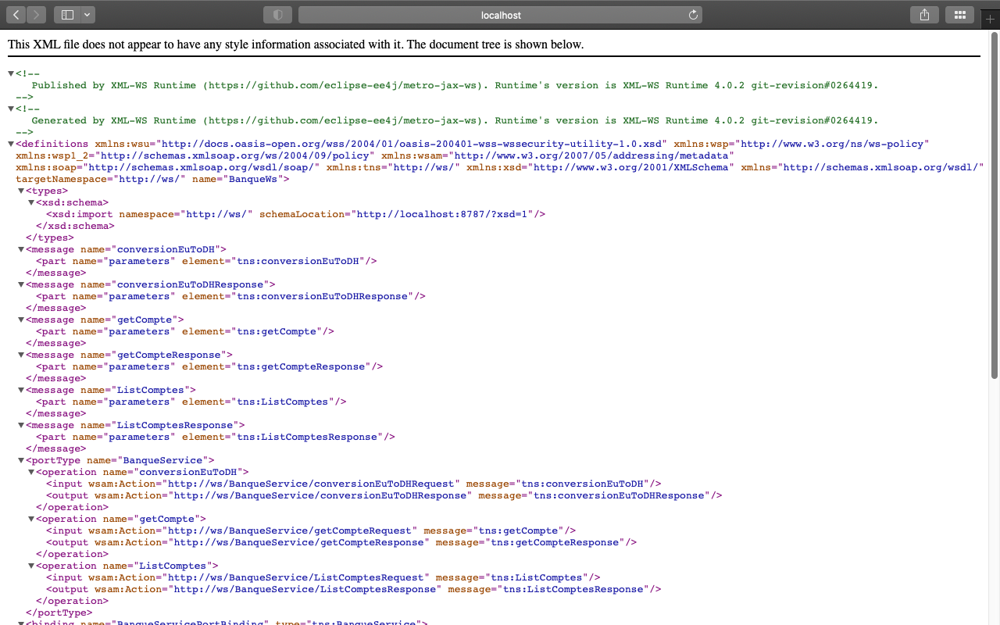
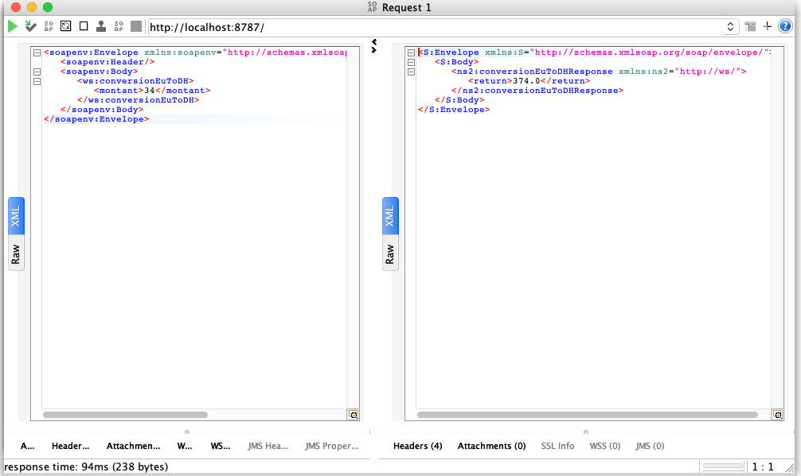

# Project Title: BanqueWs

This Java project implements a simple Web Service named `BanqueWs` for banking-related operations.

## Table of Contents

- [Introduction](#introduction)
- [PROJECT Overview](#PROJECT-overview)
- [Usage](#usage)
- [Screenshots](#screenshots)
- [Installation](#installation)
- [Java Client](#java-client)
- [Contributing](#contributing)

## Introduction

This Java project provides a Web Service for performing currency conversion, getting an account, and listing accounts.

## PROJECT Overview

The project includes a Web Service class named `BanqueService` located in the package `ws`. Here's a brief overview of the service methods:

- `conversionEuToDH`: Converts a given amount from euros to Moroccan dirhams.
- `getCompte`: Retrieves an account based on the provided code.
- `ListComptes`: Lists a set of sample accounts.

## Usage

To use this Java Web Service, follow these steps:

1. Clone the repository.
2. Open the project in your preferred Java IDE.
3. Run the `ServerJws` class to deploy the Web Service.

## Screenshots

Web service deployed.

WSDL.

SOAPUI Test.

## Installation

Ensure you have Java and a suitable IDE installed. Clone the repository and import the project into your IDE.

## Java Client

A Java client has been developed to consume this Web Service. You can find the client's source code and usage instructions in the following repository:

[Java Client Repository](https://github.com/Hamhamdi/ClientWs_SOAP.git)

## Contributing

Feel free to contribute to this project. Fork the repository, make your changes, and submit a pull request.

